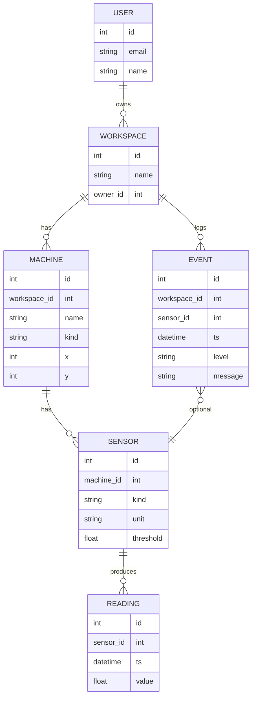

# Data Model (ERD)

This document describes the core entities and relationships used by ServoSenseApp.

* **User** owns Workspaces.
* **Workspace** groups Machines and Events.
* **Machine** can have multiple Sensors and a canvas position `(x, y)`.
* **Sensor** may be attached to a Machine (nullable FK) and emits Readings.
* **Reading** is a time‑stamped numeric value for a Sensor.
* **Event** belongs to a Workspace and may optionally reference a Sensor.

## Entity‑Relationship Diagram



## API Touchpoints

* GET `/api/workspaces/{id}/topology/` – workspace + machines + sensors (for canvas)
* GET `/api/workspaces/{id}/latest-readings/` – last reading per sensor
* PATCH `/api/core/machines/{id}/` – update `x`,`y`, `name`, `kind`
* PATCH `/api/core/sensors/{id}/` – (re)assign `machine` or set `threshold`

```---

## Field Notes

* **Machine.(x, y)** – persisted canvas coordinates for the editor; updated via `PATCH /api/core/machines/{id}/`.
* **Sensor.machine** – nullable; when `null`, the sensor appears in the **Pool** on the UI and can be drag‑assigned.
* **Sensor.kind → unit** – default display unit per kind (e.g., `temperature → °C`, `current → A`, `vibration → mm/s`).
* **Event.level** – thresholds/diagnostics: `INFO`, `WARN`, `CRIT`.
* **Reading.ts** – server timestamp when the sample was recorded.

## Invariants

* A Reading **must** reference an existing Sensor.
* An Event **must** reference a Workspace and **may** reference a Sensor.
* Deleting a Machine cascades to its Sensors (and their Readings), per Django FK rules.

## Example Queries (Django ORM)

```py
# Count sensors per workspace
Workspace.objects.annotate(sensors_count=Count('machines__sensors', distinct=True))

# Latest reading per sensor (simplified)
from django.db.models import Max
latest = (Reading.objects
  .values('sensor_id')
  .annotate(last_ts=Max('ts')))
```

**See also:**`docs/WS_PROTOCOL.md` (WebSocket messages), `docs/API_DOCS.md` (schema & static docs).
